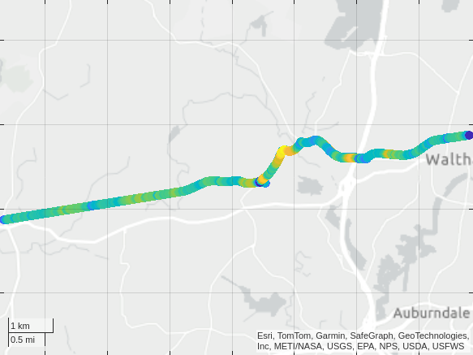
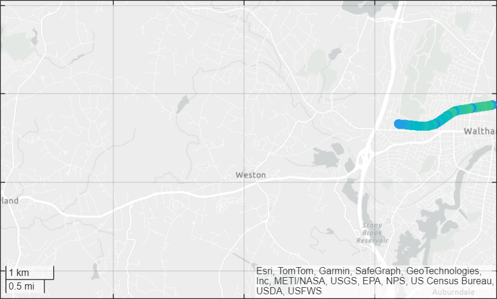
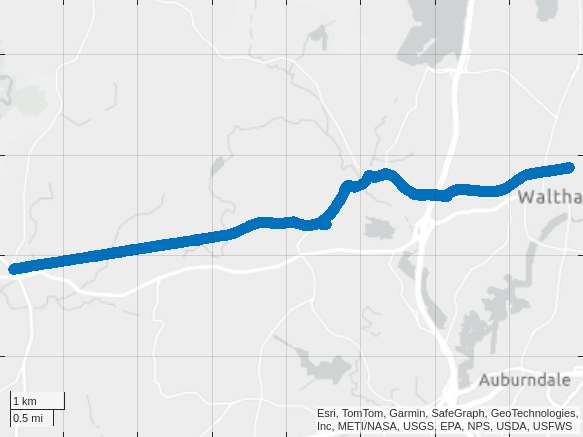

# Cycling
<a name="beginToc"></a>

[](https://matlab.mathworks.com/open/github/v1?repo=yanndebray/cycling)

Cycling data tracked with MATLAB Mobile 🚴📲

https://github.com/user-attachments/assets/b3e498bf-fb29-4ef6-8e2b-334b1059411e


## Table of Contents
&emsp;&emsp;[Mobile sensor data](#mobile-sensor-data)
 
&emsp;&emsp;[Metrics](#metrics)
 
&emsp;&emsp;[Animation](#animation)
 
&emsp;&emsp;[Strava](#strava)
 
&emsp;&emsp;[Garmin](#garmin)
 
&emsp;&emsp;[Helpers](#helpers)
 
<a name="endToc"></a>

## Mobile sensor data

Consolidate several recordings of the position into one ride table

```matlab
files = dir("/MAT LAB Drive/MobileSensorData/*.mat")
```
|Fields|name|folder|date|bytes|isdir|datenum|
|:--:|:--:|:--:|:--:|:--:|:--:|:--:|
|1|'sensorlog_20250621_165436.mat'|'/MATLAB Drive/MobileSensorData'|'21-Jun-2025 21:10:09'|1030830|0|7.3979e+05|
|2|'sensorlog_20250621_171213.mat'|'/MATLAB Drive/MobileSensorData'|'21-Jun-2025 21:28:02'|1066955|0|7.3979e+05|
|3|'sensorlog_20250621_173108.mat'|'/MATLAB Drive/MobileSensorData'|'21-Jun-2025 21:46:28'|1021062|0|7.3979e+05|
|4|'sensorlog_20250621_174815.mat'|'/MATLAB Drive/MobileSensorData'|'21-Jun-2025 22:02:58'|981639|0|7.3979e+05|

```matlab
ride = table();
for i = 1:size(files,1)
    load([files(i).folder,'/',files(i).name])
    ride = [Position;ride];
end
Position = sortrows(ride,"Timestamp","ascend")
```
| |Timestamp|latitude|longitude|altitude|speed|course|hacc|
|:--:|:--:|:--:|:--:|:--:|:--:|:--:|:--:|
|1|21-Jun-2025 16:54:36.413|42.3813|-71.2367|-14.6300|0|0|6.2900|
|2|21-Jun-2025 16:54:37.000|42.3813|-71.2367|-14.6300|0|0|6.2900|
|3|21-Jun-2025 16:54:38.000|42.3813|-71.2367|-14.8250|0|0|5.1450|
|4|21-Jun-2025 16:54:39.000|42.3813|-71.2367|-14.5190|0|0|4.3170|
|5|21-Jun-2025 16:54:40.000|42.3813|-71.2367|-14.9760|0|0|4.0480|
|6|21-Jun-2025 16:54:41.000|42.3813|-71.2367|-14.9260|0.2300|173.8000|3.7900|
|7|21-Jun-2025 16:54:42.000|42.3813|-71.2367|-15.1780|0.2500|94.9000|3.7900|
|8|21-Jun-2025 16:54:43.000|42.3813|-71.2367|-15.2930|0|0|3.7900|
|9|21-Jun-2025 16:54:44.000|42.3813|-71.2367|-15.6550|0.1700|253.6000|3.7900|
|10|21-Jun-2025 16:54:45.000|42.3812|-71.2367|-14.9630|2.3200|255.2000|3.7900|
|11|21-Jun-2025 16:54:46.000|42.3812|-71.2367|-14.5810|1.8600|262.1000|3.7900|
|12|21-Jun-2025 16:54:47.000|42.3812|-71.2368|-14.0630|2.5300|255.3000|3.7900|
|13|21-Jun-2025 16:54:48.000|42.3812|-71.2368|-14.4450|2.8500|251.2000|3.7900|
|14|21-Jun-2025 16:54:49.000|42.3812|-71.2368|-14.5220|2.9300|251.2000|3.7900|

```matlab
clf
% Create figure
fig = figure('Color', 'w');
% Create geoaxes and fill entire figure
gax = geoaxes(fig, 'Position', [0 0 1 1]);
% geobasemap(gax, 'streets')  % or 'topographic', 'satellite', etc.
geoscatter(Position.latitude,Position.longitude,60,Position.speed,"filled")
% colormap turbo
clim([min(Position.speed), max(Position.speed)])
colorbar('off')
% Set map view to cover the whole route
geolimits([min(Position.latitude)-0.001, max(Position.latitude)+0.001], [min(Position.longitude)-0.001, max(Position.longitude)+0.001])
% save to png
saveas(gcf, 'ride_map.png');
```



## Metrics
```matlab
duration = Position.Timestamp(end)-Position.Timestamp(1)
```

```matlabTextOutput
duration = duration
   01:08:07

```

```matlab
meanspeed = mean(Position.speed) % m/s
```

```matlabTextOutput
meanspeed = 6.1967
```

```matlab
meanspeedkmh = meanspeed * 3.6
```

```matlabTextOutput
meanspeedkmh = 22.3082
```

```matlab
% Calculate the total distance traveled using the haversine formula
distance = 0;
for j = 1:length(Position.latitude)-1
    distance = distance + haversine(Position.latitude(j), Position.longitude(j), Position.latitude(j+1), Position.longitude(j+1));
end
distance
```

```matlabTextOutput
distance = 2.2514e+04
```

## Animation

Animate (limited to 1000 frames)

```matlab
clf
% Extract variables
lat = Position.latitude;
lon = Position.longitude;
speed = Position.speed;
time = Position.Timestamp;
% Create figure
fig = figure('Color', 'w');

% Create geoaxes and fill entire figure
gax = geoaxes(fig, 'Position', [0 0 1 1]);
% geobasemap(gax, 'streets')  % or 'topographic', 'satellite', etc.
hold(gax, 'on')

% Initial trail plot
trail = geoscatter(lat(1), lon(1), 60, speed(1), 'filled'); % trail of the path

% colormap turbo
clim([min(speed), max(speed)])
colorbar('off')
hold(gax,'off')

% Set map view to cover the whole route
geolimits([min(lat)-0.001, max(lat)+0.001], [min(lon)-0.001, max(lon)+0.001])

% Animation loop, only every 4th frame
for k = 1:4:length(lat)
    set(trail, ...
        'LatitudeData', lat(1:k), ...
        'LongitudeData', lon(1:k), ...
        'CData', speed(1:k));  % color by speed
    
    % title(string(time(k)), 'FontSize', 14)
    drawnow
    
    % % Optional: pause based on time delta (real time simulation)
    % if k > 1
    %     dt = seconds(time(k) - time(k-1));
    %     pause(dt);  % sampling is every second
    % end
end
```



Animate a part of the ride (third recording)

```matlab
load("/MATLAB Drive/MobileSensorData/sensorlog_20250621_173108.mat")
% lat = 42.3721;lon = -71.3001;
i = 796;

% Extract variables
lat = Position.latitude;
lon = Position.longitude;
speed = Position.speed;
time = Position.Timestamp;
% Create figure
fig = figure('Color', 'w');

% Create geoaxes and fill entire figure
gax = geoaxes(fig, 'Position', [0 0 1 1]);
% geobasemap(gax, 'streets')  % or 'topographic', 'satellite', etc.
hold(gax, 'on')

% Initial trail plot
trail = geoscatter(lat(1:i), lon(1:i), 60, speed(1:i), 'filled'); % trail of the path

% colormap turbo
clim([min(speed), max(speed)])
colorbar('off')
% hold(gax,'off')

% Set map view to cover the whole route
geolimits([min(lat)-0.001, max(lat)+0.001], [min(lon)-0.001, max(lon)+0.001])

% Animation loop
for k = i:length(lat)
    set(trail, ...
        'LatitudeData', lat(1:k), ...
        'LongitudeData', lon(1:k), ...
        'CData', speed(1:k));  % color by speed
    
    % title(string(time(k)), 'FontSize', 14)
    drawnow
    
    % % Optional: pause based on time delta (real time simulation)
    % if k > 1
    %     dt = seconds(time(k) - time(k-1));
    %     pause(dt);  % sampling is every second
    % end
end
```

## Strava

Import GPX data from Strava

```matlab
data = gpxread('strava.gpx')
```

```matlabTextOutput
data = 
 841x1 geopoint vector with properties:

 Collection properties:
     Geometry: 'point'
     Metadata: [1x1 struct]
 Feature properties:
     Latitude: [42.3812 42.3812 42.3812 42.3812 42.3812 42.3812 42.3812 42.3811 42.3811 42.3811 42.3811 42.3811 42.3811 42.3810 42.3810 42.3810 42.3809 42.3809 42.3809 42.3808 42.3807 42.3806 42.3806 42.3806 42.3806 42.3806 42.3806 ... ] (1x841 double)
    Longitude: [-71.2366 -71.2366 -71.2366 -71.2367 -71.2367 -71.2369 -71.2372 -71.2376 -71.2376 -71.2378 -71.2380 -71.2380 -71.2382 -71.2385 -71.2385 -71.2389 -71.2391 -71.2395 -71.2398 -71.2404 -71.2410 -71.2415 -71.2417 -71.2418 ... ] (1x841 double)
    Elevation: [15.9000 15.9000 15.9000 15.9000 15.9000 16.1000 16.1000 16.2000 16.2000 16.3000 16.5000 16.6000 16.8000 17.2000 17.3000 18 18.2000 18.5000 18.9000 19.6000 20.3000 20.9000 21 21.1000 21.3000 21.4000 21.6000 21.7000 ... ] (1x841 double)
         Time: {1x841 cell}

```

```matlab
geoscatter(data.Latitude,data.Longitude,60,"filled")
```



## Garmin
```matlab
pe = pyenv(ExecutionMode="OutOfProcess");
```

```matlab
garmin = py.importlib.import_module("garmin_fit_sdk");
stream = garmin.Stream.from_file("garmin.fit");
decoder = garmin.Decoder(stream);
m = pyrun("messages, errors = decoder.read()","messages",decoder=decoder);
m = struct(m)
```

```matlabTextOutput
m = struct with fields:
        file_id_mesgs: [1x1 py.list]
       activity_mesgs: [1x1 py.list]
        session_mesgs: [1x1 py.list]
            lap_mesgs: [1x5 py.list]
          event_mesgs: [1x8 py.list]
    device_info_mesgs: [1x25 py.list]
         record_mesgs: [1x841 py.list]

```

```matlab
laps = cell(m.lap_mesgs);
laps{1}
```

```matlabTextOutput
ans = 
  Python dict with no properties.

    {'timestamp': datetime.datetime(2025, 6, 21, 20, 54, 32, tzinfo=datetime.timezone.utc), 'total_ascent': 89, 'total_distance': 5000.0, 'start_time': datetime.datetime(2025, 6, 21, 20, 54, 32, tzinfo=datetime.timezone.utc), 'total_elapsed_time': 847.506, 'total_timer_time': 847.506}

```

```matlab
events = cell(m.event_mesgs);
events{1}
```

```matlabTextOutput
ans = 
  Python dict with no properties.

    {'timestamp': datetime.datetime(2025, 6, 21, 20, 54, 32, tzinfo=datetime.timezone.utc), 'data': 0, 'event': 'timer', 'event_type': 'start', 'event_group': 0, 'timer_trigger': 'manual'}

```

```matlab
record = cell(m.record_mesgs);
record{42}
```

```matlabTextOutput
ans = 
  Python dict with no properties.

    {'position_lat': 505612213, 'distance': 839.63, 'enhanced_altitude': 34.200000000000045, 'timestamp': datetime.datetime(2025, 6, 21, 20, 57, 5, tzinfo=datetime.timezone.utc), 'position_long': -850005663, 'enhanced_speed': 4.469}

```

```matlab
struct(record{42})
```

```matlabTextOutput
ans = struct with fields:
         position_lat: [1x1 py.int]
             distance: 839.6300
    enhanced_altitude: 34.2000
            timestamp: 21-Jun-2025 20:57:05
        position_long: [1x1 py.int]
       enhanced_speed: 4.4690

```

```matlab
T = table(pyrun("import pandas as pd; df = pd.DataFrame(messages['record_mesgs'])","df"));
```

In Garmin/FIT files, latitude and longitude aren’t stored in degrees but in **“semicircles”** (signed 32\-bit integers).  To turn them into ordinary decimal degrees you use the fact that $2^{31} \;\textrm{semicircles}=180°$ 

```matlab
% Suppose your table is T, with vars position_lat/position_long:
degPerSemi = 180/2^31;
T.lat  = double(T.position_lat ) * degPerSemi;
T.lon  = double(T.position_long) * degPerSemi;
```

```matlab
figure
g = geoaxes;               % create a geographic axes
geoscatter(g, T.lat, T.lon, 60,T.enhanced_speed, 'filled')
title('My Garmin Track')
```


## Helpers

[Haversine](https://en.wikipedia.org/wiki/Haversine_formula) (because the earth isn't flat)


```matlab
function d = haversine(lat1, lon1, lat2, lon2, R)
% HAVERSINE  Great‐circle distance between points on a sphere
%
%   d = HAVERSINE(lat1, lon1, lat2, lon2) returns the distance (in meters)
%   between points (lat1,lon1) and (lat2,lon2), specified in decimal degrees,
%   assuming a spherical Earth of radius R = 6371000 m.
%
%   d = HAVERSINE(lat1, lon1, lat2, lon2, R) lets you specify a different
%   radius R (same units as the output d).

    if nargin<5
        R = 6371000;  % mean Earth radius in meters
    end

    % Convert degrees to radians
    toRad = @(x) x .* (pi/180);
    phi1 = toRad(lat1);
    phi2 = toRad(lat2);
    deltaphi = toRad(lat2 - lat1);
    deltalambda = toRad(lon2 - lon1);

    % Haversine formula
    a = sin(deltaphi/2).^2 + cos(phi1) .* cos(phi2) .* sin(deltalambda/2).^2;
    c = 2 .* atan2( sqrt(a), sqrt(1 - a) );

    d = R .* c;
end
```

Install python packages on MATLAB Online


[https://developer.garmin.com/fit/example\-projects/python/](https://developer.garmin.com/fit/example-projects/python/)

```matlab
websave("/tmp/get-pip.py","https://bootstrap.pypa.io/get-pip.py")
!python /tmp/get-pip.py
!python -m pip install garmin-fit-sdk pandas
```

```matlab
export cycling.mlx README.md;
```
