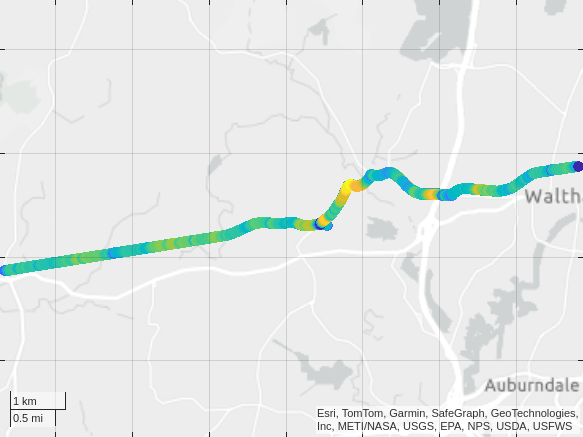

# Cycling

[](https://matlab.mathworks.com/open/github/v1?repo=yanndebray/cycling)

Cycling data tracked with MATLAB Mobile 🚴📲

https://github.com/user-attachments/assets/b3e498bf-fb29-4ef6-8e2b-334b1059411e

Consolidate several recordings of the position into one ride table

```matlab
files = dir("/MATLAB Drive/MobileSensorData/*.mat")
```


|Fields|name|folder|date|bytes|isdir|datenum|
|:--:|:--:|:--:|:--:|:--:|:--:|:--:|
|1|'sensorlog_20250621_165436.mat'|'/MATLAB Drive/MobileSensorData'|'21-Jun-2025 21:10:09'|1030830|0|7.3979e+05|
|2|'sensorlog_20250621_171213.mat'|'/MATLAB Drive/MobileSensorData'|'21-Jun-2025 21:28:02'|1066955|0|7.3979e+05|
|3|'sensorlog_20250621_173108.mat'|'/MATLAB Drive/MobileSensorData'|'21-Jun-2025 21:46:28'|1021062|0|7.3979e+05|
|4|'sensorlog_20250621_174815.mat'|'/MATLAB Drive/MobileSensorData'|'21-Jun-2025 22:02:58'|981639|0|7.3979e+05|


```matlab
ride = table();
for i = 1:size(files,1)
    load([files(i).folder,'/',files(i).name])
    ride = [Position;ride];
end
Position = ride
```


| |Timestamp|latitude|longitude|altitude|speed|course|hacc|
|:--:|:--:|:--:|:--:|:--:|:--:|:--:|:--:|
|1|21-Jun-2025 17:48:16.000|42.3721|-71.2924|20.8370|0|0|3.7900|
|2|21-Jun-2025 17:48:17.000|42.3721|-71.2924|21.1470|0|0|3.7900|
|3|21-Jun-2025 17:48:18.000|42.3721|-71.2924|20.8270|0|0|3.7900|
|4|21-Jun-2025 17:48:19.000|42.3721|-71.2924|21.1380|0|0|3.7900|
|5|21-Jun-2025 17:48:20.000|42.3721|-71.2924|20.6200|0|0|3.7900|
|6|21-Jun-2025 17:48:21.000|42.3721|-71.2924|20.5090|0|0|3.7900|
|7|21-Jun-2025 17:48:22.000|42.3721|-71.2924|20.3700|0|0|3.7900|
|8|21-Jun-2025 17:48:23.000|42.3721|-71.2924|20.4390|0|0|3.7900|
|9|21-Jun-2025 17:48:24.000|42.3721|-71.2924|20.9470|0.4300|63.7000|3.7900|
|10|21-Jun-2025 17:48:25.000|42.3721|-71.2924|20.1020|1.7700|79.3000|3.7900|
|11|21-Jun-2025 17:48:26.000|42.3722|-71.2924|20.9990|1.1900|78.6000|3.7900|
|12|21-Jun-2025 17:48:27.000|42.3722|-71.2924|20.4160|2.6200|69.2000|3.7900|
|13|21-Jun-2025 17:48:28.000|42.3722|-71.2923|20.5420|3.2700|58.9000|3.7900|
|14|21-Jun-2025 17:48:29.000|42.3722|-71.2923|20.1170|3.2500|53.1000|3.7900|


```matlab
clf
% Create figure
fig = figure('Color', 'w');
% Create geoaxes and fill entire figure
gax = geoaxes(fig, 'Position', [0 0 1 1]);
% geobasemap(gax, 'streets')  % or 'topographic', 'satellite', etc.
geoscatter(Position.latitude,Position.longitude,60,Position.speed,"filled")
% colormap turbo
clim([min(speed), max(speed)])
colorbar('off')
% Set map view to cover the whole route
geolimits([min(lat)-0.001, max(lat)+0.001], [min(lon)-0.001, max(lon)+0.001])
% save to png
saveas(gcf, 'ride_map.png');
```


```matlab
duration = Position.Timestamp(end)-Position.Timestamp(1)
```

```matlabTextOutput
duration = duration
   01:08:07

```

```matlab
meanspeed = mean(Position.speed) % m/s
```

```matlabTextOutput
meanspeed = 6.1967
```

```matlab
meanspeedkmh = meanspeed * 3.6
```

```matlabTextOutput
meanspeedkmh = 22.3082
```

```matlab
% Calculate the total distance traveled using the haversine formula
distance = 0;
for j = 1:length(lat)-1
    distance = distance + haversine(lat(j), lon(j), lat(j+1), lon(j+1));
end
distance
```

```matlabTextOutput
distance = 2.2514e+04
```


Animate (limited to 1000 frames)

```matlab
clf
% Extract variables
lat = Position.latitude;
lon = Position.longitude;
speed = Position.speed;
time = Position.Timestamp;
% Create figure
fig = figure('Color', 'w');

% Create geoaxes and fill entire figure
gax = geoaxes(fig, 'Position', [0 0 1 1]);
% geobasemap(gax, 'streets')  % or 'topographic', 'satellite', etc.
hold(gax, 'on')

% Initial trail plot
trail = geoscatter(lat(1), lon(1), 60, speed(1), 'filled'); % trail of the path

% colormap turbo
clim([min(speed), max(speed)])
colorbar('off')
hold(gax,'off')

% Set map view to cover the whole route
geolimits([min(lat)-0.001, max(lat)+0.001], [min(lon)-0.001, max(lon)+0.001])

% Animation loop, only every 4th frame
for k = 1:4:length(lat)
    set(trail, ...
        'LatitudeData', lat(1:k), ...
        'LongitudeData', lon(1:k), ...
        'CData', speed(1:k));  % color by speed
    
    % title(string(time(k)), 'FontSize', 14)
    drawnow
    
    % % Optional: pause based on time delta (real time simulation)
    % if k > 1
    %     dt = seconds(time(k) - time(k-1));
    %     pause(dt);  % sampling is every second
    % end
end
```



Animate a part of the ride (third recording)

```matlab
load("/MATLAB Drive/MobileSensorData/sensorlog_20250621_173108.mat")
% lat = 42.3721;lon = -71.3001;
i = 796;

% Extract variables
lat = Position.latitude;
lon = Position.longitude;
speed = Position.speed;
time = Position.Timestamp;
% Create figure
fig = figure('Color', 'w');

% Create geoaxes and fill entire figure
gax = geoaxes(fig, 'Position', [0 0 1 1]);
% geobasemap(gax, 'streets')  % or 'topographic', 'satellite', etc.
hold(gax, 'on')

% Initial trail plot
trail = geoscatter(lat(1:i), lon(1:i), 60, speed(1:i), 'filled'); % trail of the path

% colormap turbo
clim([min(speed), max(speed)])
colorbar('off')
% hold(gax,'off')

% Set map view to cover the whole route
geolimits([min(lat)-0.001, max(lat)+0.001], [min(lon)-0.001, max(lon)+0.001])

% Animation loop
for k = i:length(lat)
    set(trail, ...
        'LatitudeData', lat(1:k), ...
        'LongitudeData', lon(1:k), ...
        'CData', speed(1:k));  % color by speed
    
    % title(string(time(k)), 'FontSize', 14)
    drawnow
    
    % % Optional: pause based on time delta (real time simulation)
    % if k > 1
    %     dt = seconds(time(k) - time(k-1));
    %     pause(dt);  % sampling is every second
    % end
end
```


Helpers

```matlab
function d = haversine(lat1, lon1, lat2, lon2, R)
% HAVERSINE  Great‐circle distance between points on a sphere
%
%   d = HAVERSINE(lat1, lon1, lat2, lon2) returns the distance (in meters)
%   between points (lat1,lon1) and (lat2,lon2), specified in decimal degrees,
%   assuming a spherical Earth of radius R = 6371000 m.
%
%   d = HAVERSINE(lat1, lon1, lat2, lon2, R) lets you specify a different
%   radius R (same units as the output d).

    if nargin<5
        R = 6371000;  % mean Earth radius in meters
    end

    % Convert degrees to radians
    toRad = @(x) x .* (pi/180);
    phi1 = toRad(lat1);
    phi2 = toRad(lat2);
    deltaphi = toRad(lat2 - lat1);
    deltalambda = toRad(lon2 - lon1);

    % Haversine formula
    a = sin(deltaphi/2).^2 + cos(phi1) .* cos(phi2) .* sin(deltalambda/2).^2;
    c = 2 .* atan2( sqrt(a), sqrt(1 - a) );

    d = R .* c;
end
```
